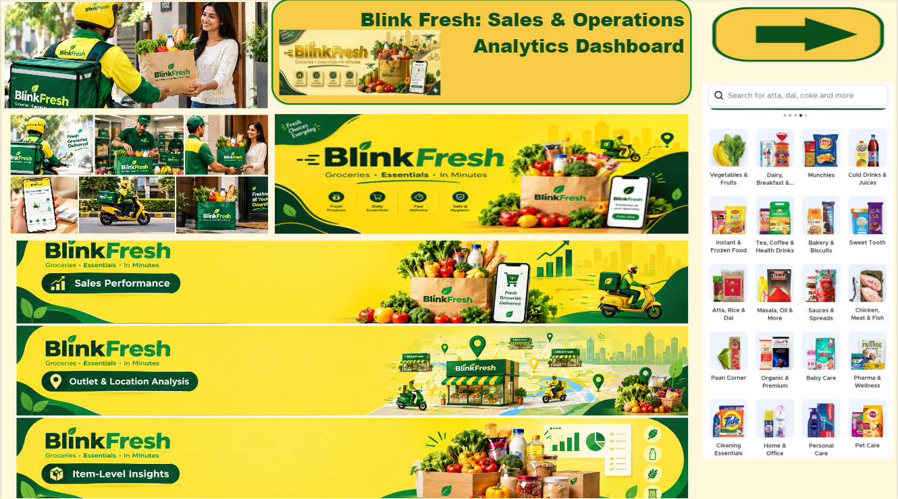
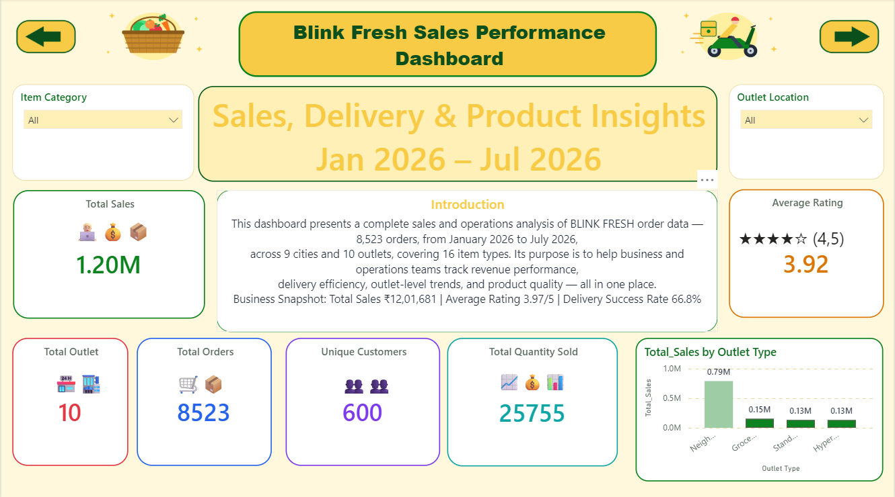
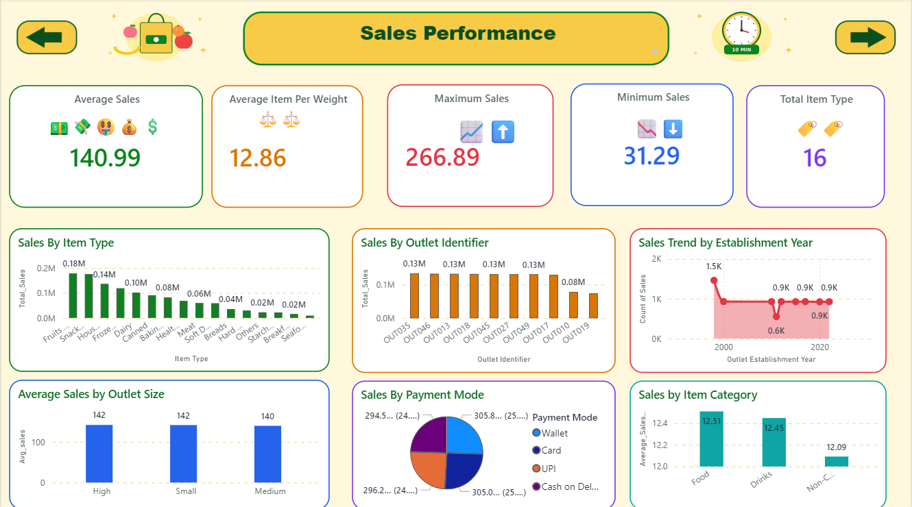
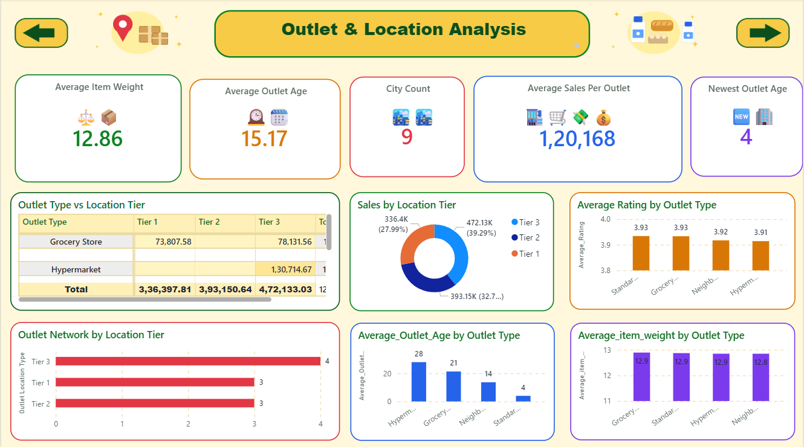
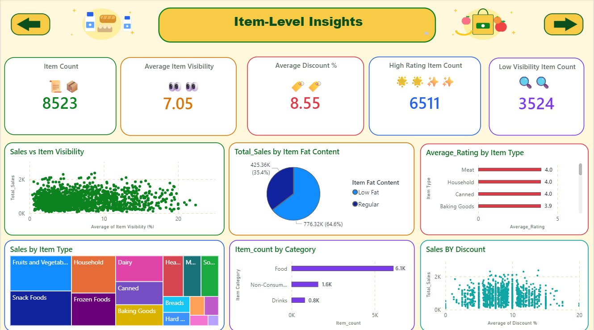
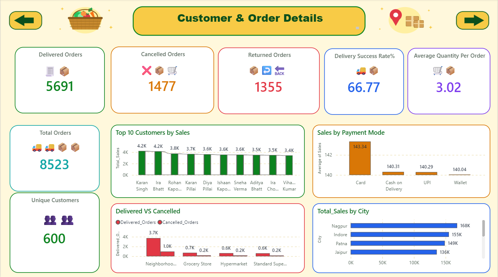
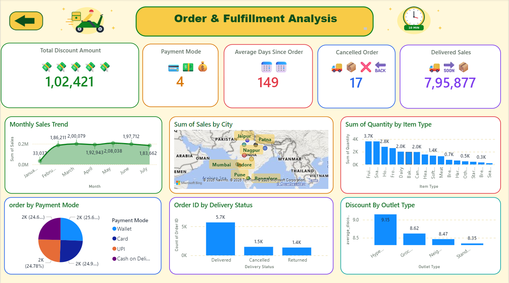

# BLINK FRESH — Sales & Operations Dashboard (Power BI)

An end-to-end **sales, outlet and delivery-operations analytics dashboard** built in Power BI, covering revenue performance, outlet and location analysis, item-level insights, customer and order behaviour, and delivery/fulfilment — all on one data model of quick-commerce grocery orders.

> 📊 Power BI Desktop | 7 report pages | 8,523 orders | 9 cities | 10 outlets | 16 item types | Jan – Jul 2026

---

## 📌 Project Overview

Quick-commerce businesses need one place to see revenue, outlet performance, product quality and delivery efficiency together instead of siloed reports. This project analyses **8,523 BLINK FRESH orders (January 2026 – July 2026)** across **9 cities and 10 outlets**, and turns them into an interactive Power BI report for business and operations teams.

Every analytical page (3–7) follows the same design: **KPI cards on top, a set of charts below, consistent colours and navigation buttons** — each page looks at a different slice of the data.

**Note:** this is a portfolio / learning project built to demonstrate Power BI skills. It is not official company data.

---

## 🖼️ Dashboard Preview

### Cover


### Introduction


### Sales Performance


### Outlet & Location Analysis


### Item-Level Insights


### Customer & Order Detail


### Order & Fulfillment Analysis


---

## 🗂️ Data Model

A single fact table, **`blink_fresh_data`**, with one row per order line, plus DAX measures for every KPI.

| Field group | Columns |
|---|---|
| **Order** | Order ID, Order Date, Quantity, Sales, Discount %, Payment Mode, Delivery Status |
| **Customer** | Customer Name |
| **Item** | Item Identifier, Item Type, Item Category, Item Fat Content, Item Visibility (%), Item Weight |
| **Outlet** | Outlet Identifier, Outlet Type, Outlet Size, Outlet Location Type, Outlet Establishment Year |
| **Location** | City |

**Key DAX measures:** `Total_Sales`, `Total_order`, `Unique_Customer`, `Total_Quantity`, `Average_Rating`, `Avg_sales`, `Maximum_Sales`, `minimum_sales`, `Delivered_Orders`, `Cancelled_Orders`, `Returned_Orders`, `Delivery_Success_Rate_%`, `Cancelled_Order_Rate_%`, `Delivered_Sales`, `Average_Sales_per_Outlet`, `Average_Outlet_Age`, `average_discount_%`, `Total_Discount_Amount`, `Average_item_visibility`, `High_Rating_Item_count`, `Low_visibility_Item_count`, `Average_Days_Since_Order` and more.

---

## 📑 Report Pages

### 1. Cover
Landing page with the project title and navigation into the report.

---

### 2. Introduction
Project overview and headline numbers.

**KPIs:**
- Total Sales: **₹12,01,681 (1.20M)**
- Average Rating: **3.92 / 5**
- Total Outlets: **10**
- Total Orders: **8,523**
- Unique Customers: **600**
- Total Quantity Sold: **25,755**

**Visuals:** Sales by Outlet Type

**Filters:** Outlet Location Type / City / Item Category

---

### 3. Sales Performance
How much the business sells, and where it comes from.

**KPIs:**
- Average Sales: **140.99**
- Average Item Weight: **12.86**
- Maximum Sales: **266.89**
- Minimum Sales: **31.29**
- Total Item Types: **16**

**Breakdowns:** Sales by Item Type, average sales by Outlet Size, sales by Outlet, sales by Payment Mode, average sales per weight by Item Category, sales trend by Outlet Establishment Year

---

### 4. Outlet & Location Analysis
Which outlets and locations perform best.

**KPIs:**
- Average Item Weight: **12.86**
- Average Outlet Age: **15.17 years**
- City Count: **9**
- Average Sales per Outlet: **₹1,20,168**
- Newest Outlet Age: **4 years**

**Breakdowns:** Sales by Outlet Location Type (donut), Outlet Type × Location Type sales table, outlets by location type, average rating / outlet age / item weight by Outlet Type

---

### 5. Item-Level Insights
Which products drive sales and quality.

**KPIs:**
- Item Count: **8,523**
- Average Item Visibility: **7.05**
- Average Discount %: **8.55**
- High-Rating Item Count: **6,511**
- Low-Visibility Item Count: **3,524**

**Breakdowns:** Visibility vs Sales (scatter), Discount % vs Sales (scatter), sales by Fat Content, sales by Item Type (treemap), average rating by Item Type, item count by Item Category

---

### 6. Customer & Order Detail
How customers order and how orders end up.

**KPIs:**
- Delivered Orders: **5,691**
- Cancelled Orders: **1,477**
- Returned Orders: **1,355**
- Delivery Success Rate: **66.77%**
- Average Quantity per Order: **3.02**
- Total Orders: **8,523**
- Unique Customers: **600**

**Breakdowns:** Sales by Customer, sales by Payment Mode, delivered vs cancelled orders by Outlet Type, sales by City

---

### 7. Order & Fulfillment Analysis
Delivery performance, payments and geography.

**KPIs:**
- Total Discount Amount: **1,02,421**
- Payment Modes: **4** (Wallet, Card, UPI, Cash on Delivery)
- Average Days Since Order: **149**
- Cancelled Order Rate: **17%**
- Delivered Sales: **₹7,95,877**

**Breakdowns:** Sales trend by Order Date, orders by Payment Mode, sales map by City, orders by Delivery Status, quantity by Item Type, average discount % by Outlet Type

---

## 💡 Key Insights

✅ **Business Snapshot**
- 8,523 orders from 600 unique customers generated ₹12,01,681 in sales (Jan – Jul 2026)
- 25,755 units sold across 9 cities, 10 outlets and 16 item types
- Average rating of 3.92 / 5

✅ **Delivery Performance**
- 5,691 orders delivered (66.77%), 1,477 cancelled and 1,355 returned, so roughly one in three orders is not completed
- Delivered orders account for ₹7,95,877 of the ₹12,01,681 total sales

✅ **Outlets & Locations**
- Tier 3 cities lead sales (₹4.72L, 39.3%), followed by Tier 2 (₹3.93L) and Tier 1 (₹3.36L)
- Nagpur (₹168K), Indore (₹155K) and Patna (₹149K) are the top cities by sales
- Neighbourhood-type outlets generate by far the most sales (about 0.79M), well ahead of the other outlet types (0.13M – 0.15M each)

✅ **Products & Customers**
- Regular fat items make up 64.6% of sales vs 35.4% for Low Fat
- Food dominates the catalogue (6.1K items) ahead of Non-Consumables (1.6K) and Drinks (0.8K)
- Payment modes are evenly split (about 25% each); Card orders have the highest average sales (143.34)
- 3,524 items have low visibility, a clear opportunity to improve placement

## 🛠️ Skills Demonstrated

| Area | Evidence |
|---|---|
| **Data Modelling** | Clean order-level table with outlet, item, customer and location attributes |
| **DAX** | Sales, rate, average, min/max and count measures used across every page |
| **Dashboard/UX Design** | Consistent KPI-cards + charts layout, custom backgrounds, icons and navigation buttons |
| **Data Storytelling** | Logical flow: overview → sales → outlets → items → customers → fulfilment |
| **Domain Knowledge** | Quick-commerce KPIs: delivery success, cancellation rate, item visibility, outlet performance |
| **Visualization Range** | Cards, column/bar/clustered, line, pie/donut, treemap, scatter, map, matrix table, slicers |

---

## 🚀 Quick Start

### Prerequisites
- **Power BI Desktop** (free download from [Microsoft](https://powerbi.microsoft.com/en-us/desktop/))

### Steps
1. **Clone this repo**
   ```bash
   git clone https://github.com/khanhusein/blinkit-fresh-power-bi-dashboard.git
   cd blinkit-fresh-power-bi-dashboard
   ```

2. **Open the dashboard**
   - Double-click `Blink_Fresh_Dashboard.pbix`
   - Or open Power BI Desktop → File → Open

3. **Explore the slicers**
   - Filter by Outlet Location Type, City and Item Category, and use the navigation buttons to move between pages

---

## 📂 Project Structure

```
blinkit-fresh-power-bi-dashboard/
├── README.md
├── LICENSE
├── Blink_Fresh_Dashboard.pbix
└── screenshots/
    ├── 01_cover.png
    ├── 02_introduction.png
    ├── 03_sales_performance.png
    ├── 04_outlet_location.png
    ├── 05_item_insights.png
    ├── 06_customer_order.png
    └── 07_fulfillment.png
```

---

## 🔮 Future Enhancements

- [ ] Drillthrough pages from summary cards to order-level detail
- [ ] Reduce cancellations: root-cause view by outlet, city and payment mode
- [ ] Live/scheduled-refresh data source (replace static import)
- [ ] Mobile-optimized dashboard views
- [ ] Forecasting of sales and order volume
- [ ] Row-level security by city or outlet manager

---

## 📝 License

This project is licensed under the [MIT License](LICENSE).

---

## 👤 Author

**Mohammed Husein Khan**

🔗 **Links:**
- [LinkedIn](https://www.linkedin.com/in/mohammed-husein-khan-615645427)
- [GitHub](https://github.com/khanhusein)

---

## 💬 Questions?

Feel free to open an **Issue** on GitHub or connect via LinkedIn for questions or collaboration opportunities.

---

**Last Updated:** September 24, 2026  
**Power BI Version:** Latest Desktop  
**Data:** Quick-commerce order dataset (Jan – Jul 2026)
